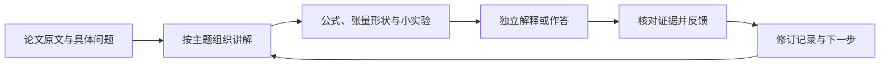

# Research Learning Workflow

**AI 辅助的论文精读与研究学习工作流**

A source-grounded workflow for reading papers, connecting mathematics to small experiments, and preserving questions, feedback, and revisions.

从论文中的一个问题出发，把原文定位、解释、推导、小实验和反馈连接起来，形成可回看、可追溯的学习记录。目前以 Attention 和扩散模型相关学习为主要案例。

**项目展示 · [源码与 MIT 许可证](https://github.com/by-lastime/research-learning-workflow) · 个人学习记录不公开**

## 一次学习如何推进

这个流程希望解决两个问题：问答结束后知识散落在聊天里，以及读过讲义容易被误记为已经掌握。长期有效的内容回到文件，推进依据来自实际解释、作答或实验。

## 组成

| 部分 | 作用 |
|---|---|
| 原始来源 | 定位论文版本、公式、图表及对应段落 |
| 主题讲义 | 连贯组织直观解释、必要推导、形状和代码关系 |
| 教学小实验 | 用可运行的局部验证帮助理解机制，并记录运行条件 |
| 独立作答 | 区分看懂、借助提示与独立解释 |
| 反馈记录 | 区分表达遗漏、核心误解和教材自身的问题 |
| 当前入口 | 明确下一项任务，保留尚未完成的内容 |

## 简要实现思路

使用 Markdown 保存讲义与规则，用结构化运行记录保存小实验结果。任务先按“局部提问、生成讲义、批改、来源核验、查询进度”分流，再读取相关材料，避免每次重读整个资料库。来源、教材、个人作答和状态各自保存；修改状态需要对应证据。

AI 用于辅助整理、解释、代码草拟和反馈；原文及实际运行结果用于核验。人的提问、判断与独立表达保留在学习过程中。

## 当前案例与边界

- **Attention：** 已有分主题讲义、作答与反馈记录，并配套双语阅读工具；整篇论文的正式学习验收仍未完成。
- **DDPM：** 已有第一讲和加噪、训练、单步采样相关的局部教学代码与运行记录；后续学习仍在推进。
- 这些是论文学习与教学验证，不作为完整论文复现或原创研究成果发布。

[查看工作模式说明](docs/approach.md) · [查看案例范围](docs/cases.md) · [展示范围](NOTICE.md)

相关项目：[论文双语阅读器](https://github.com/by-lastime/bilingual-paper-reader-showcase) · [高中数学方法题库](https://github.com/by-lastime/math-bank-showcase)

材料整理日期：2026-09-26。状态根据已有项目记录整理，本轮未重新运行实验。
